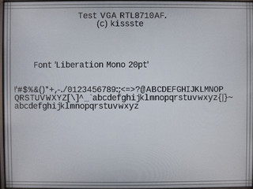

# rtl8710_VGA_Display_Driver
VGA Driver for RTL8710, RTL8711 and RTL8195 SoC

Runs resolution 800x600 @63Hz at Pixel frequency 41.33MHz.

Using 2 SPIs channels - one for video signal, second one for H-Sync 
And, one GPIO for V-Sync 

**Console command (RX/TX GB1/GB0 38400 baud):** 
ATVG - Will start the VGA Display 

**Pictures:** 
https://goo.gl/photos/ztxVsQsS6xFEcsJM6

**Wiring:** 
GPIO_A1 - VGA:Video via a resistor 
GPIO_C2 - VGA:H-Synch directly 
GPIO_A5 - VGA:V-Sync directly 

**VGA 800x600 Timing:*** 
http://tinyvga.com/vga-timing/800x600@60Hz

***Required (and not included):*** 
RTL8710 SDK3.5a GCC

***Fonts:*** 
Were generated by The Dot Factory 
http://www.eran.io/the-dot-factory-an-lcd-font-and-image-generator/ 
https://github.com/pavius/the-dot-factory
